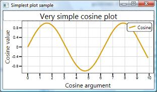
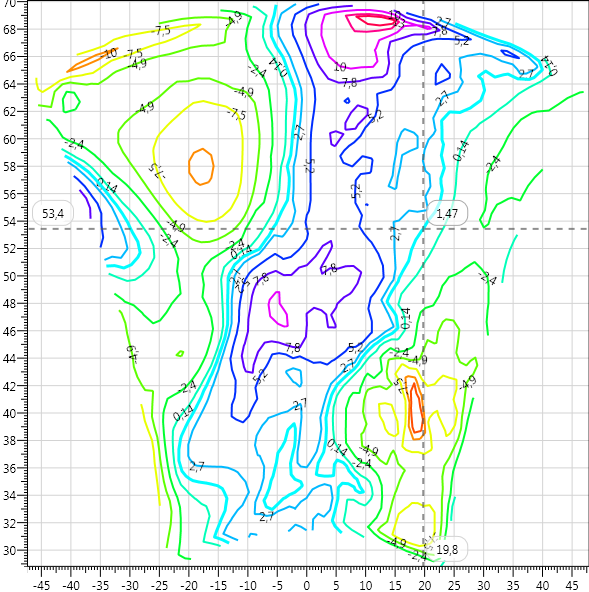
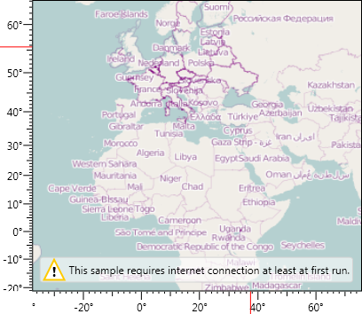
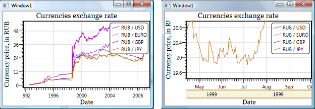
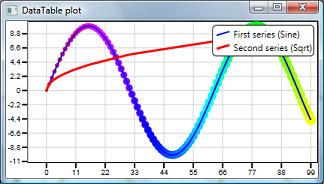
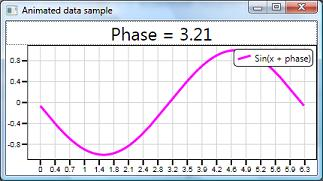
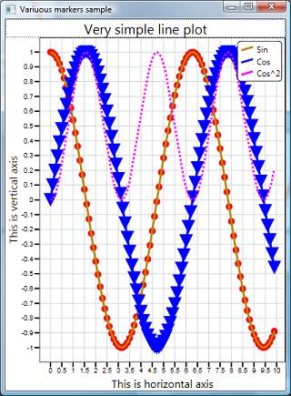
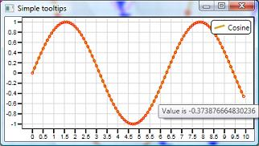
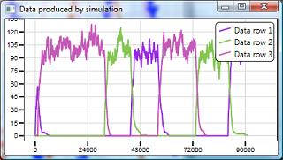

DynamicDataDisplay 1.0 is a library of WPF controls for dynamic data visualization. It features efficient binding mechanisms and real-time interactivity capable of charting millions of data points. Current release allows flexible drawing of line/marker plots.

DynamicDataDisplay controls can be used in your application in the same way as other WPF controls. Any data can be used as a source of coordinates on your chart. It can be an array, a DataTable or a function. Every change in the data source causes update of the chart. As an example, you can use this feature for monitoring running computations. Using mouse or keyboard you can zoom in deep into the graph to see its subtle details.

## How to use DynamicDataDisplay library in your projects?
# Ensure that Microsoft .NET Framework version 3.5 is installed on your computer.
# Download latest release and extract DynamicDataDisplay.dll file in a folder of your choice.
# Reference the library in you project.
# To use DynamicDataDisplay control in C#-code, add a namespace reference to DynamicDataDisplay namespace - e.g., **using Microsoft.Research.DynamicDataDisplay;**
# To use DynamicDataDisplay control in XAML, add a xml-namespace reference to DynamicDataDisplay's xml namespace - add the following line to the header of your XAML file: **xmlns:d3="http://research.microsoft.com/DynamicDataDisplay/1.0"**. Now all DynamicDataDisplay's controls are available under "d3:" prefix, e.g. **"<d3:ChartPlotter/>"**
Source code in the Samples folder will give you an idea how to come from data to an interactive chart in your application window.
# Samples Gallery

[more samples](more-samples)
* **HelloWorldSample** shows how to plot basic line graph from two arrays. Title and axis text are declared in XAML. 

* **IsolineSample** shows how to display isolines.

* **MapSample** shows tiled map with tiles downloaded from [openstreetmap.com](openstreetmap.com)

* **CurrencyExchangeSample** plots exchange rates for four main world currencies. Horizontal axis uses DateTime. 

* **DataTableSample** plots data from System.Data.DataTable object. Additional table rows named 'Index' and 'Sqrt' define marker color and size respectively. 

* **AnimatedSample** display dynamically changing data. Values of Y coordinates are changed by timer event. This sample also features programmatic creation and update of plot title.

* **MarkersSample** illustrates how to plot data using various line styles and different types of markers.

* **TooltipSample** adds textual description to each point of data. Mapping from numeric value to string is defined in sample's code.

* **SimulationSample** imitates rendering data from some simulation that constantly adds new data points.
