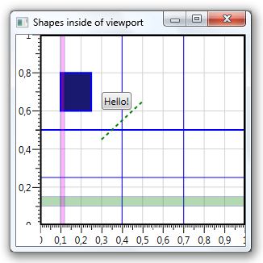

# Other samples for **DynamicDataDisplay**
* **LineSample**
 contains different simple shapes, that might be added onto Plotter:
	* horizontal and vertical lines and segments
	* open and closed rectangles
	* any WPF's UIElement
